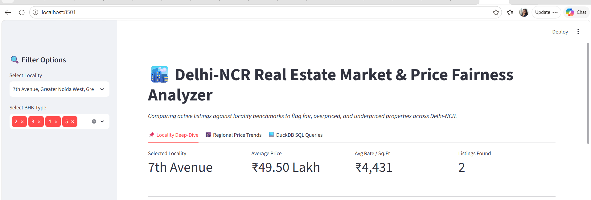
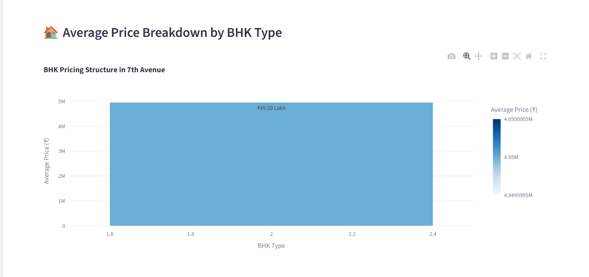
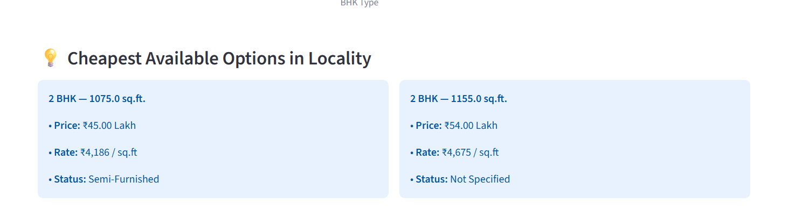
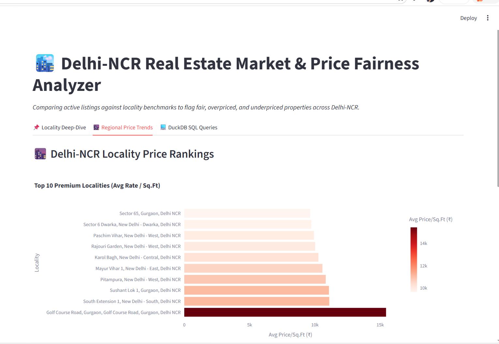
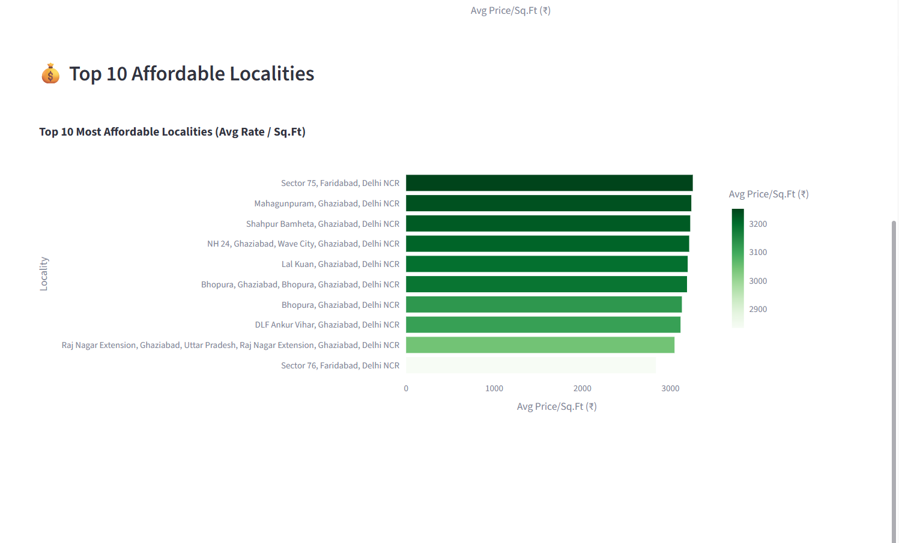
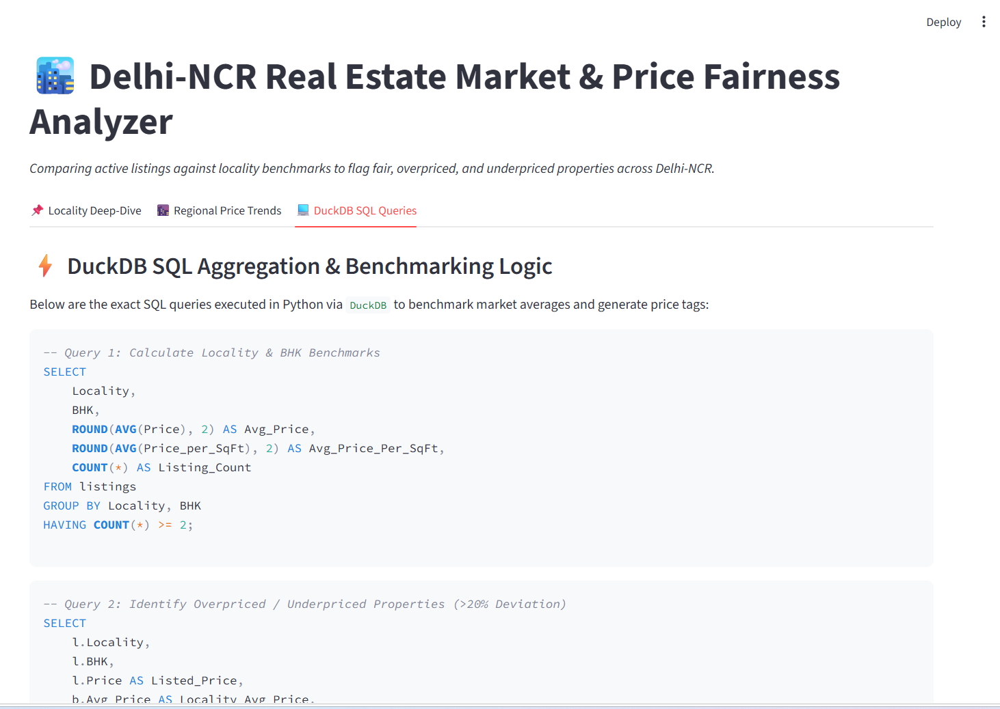

# Delhi-NCR Real Estate Market & Price Fairness Analyzer

### Live Dashboard: https://vaishnavi698-delhi-ncr-real-estate-app-6cwu4s.streamlit.app/
No installation needed - open the link and explore the dashboard directly in your browser.


---

## Overview

The real estate market across Delhi, Gurgaon, Noida, Greater Noida, Ghaziabad, and Faridabad is highly fragmented. Listing prices vary widely across localities, BHK configurations, and square footage, making it difficult for renters, buyers, and analysts to know whether a listed price actually reflects fair market value.

This project is an end-to-end data analytics application that ingests 3,772 real property listings, standardizes pricing metrics, uses DuckDB SQL to compute localized baseline medians (price per sq.ft per BHK type), and automatically flags listings that deviate by more than 20% from the local market median.


---

## Features

- **Locality Deep-Dive** - Pick a locality (e.g. Dwarka, Gurugram, Saket) and instantly see average price, price per sq.ft, and BHK-wise breakdown
- **Flagged Property Inspector** - A table of listings tagged as Overpriced, Underpriced, or Fair Market Price
- **Cheapest Options Finder** - Surfaces the most affordable available listings per locality
- **BHK Price Breakdown** - Box plots and bar charts showing price variance across 1BHK/2BHK/3BHK/etc.
- **Regional Price Trends** - Explore price patterns across Delhi-NCR sub-regions
- **Live SQL Query Console** - See the real DuckDB SQL queries powering the dashboard, embedded in-app
- **Interactive Filters** - Filter by region, locality, BHK type, and price range in real time

---

## Screenshots

**Dashboard Overview**


**Locality Deep-Dive**



**BHK Price Breakdown**



**Cheapest Options & Flagged Listings**



**Regional Price Trends**



**Regional Price Trends - Affordable Segment**



**Live DuckDB SQL Queries**



**Drilldown Table**


---

## Project Structure

```
delhi-ncr-real-estate/
  .vscode/                        Editor configurations
  data/                           Datasets folder
    MagicBricks.csv               Raw scraped property listings (3,772 rows, from Kaggle)
    cleaned_delhi_real_esta.csv   Processed and standardized dataset
  screenshots/                    App preview screenshots
  venv/                           Virtual environment (ignored by Git)
  .gitignore                      Files excluded from Git tracking
  app.py                          Main Streamlit web application
  data_cleaning.py                Data processing and standardization script
  queries.sql                     Standalone DuckDB SQL benchmarking queries
  README.md                       This file
  requirements.txt                Python dependencies
```

---

## Data Cleaning & Feature Engineering

**Source:** Housing Price Dataset of Delhi, India - Kaggle
https://www.kaggle.com/datasets/goelyash/housing-price-dataset-of-delhiindia (3,772 raw records)

Key steps performed in `data_cleaning.py`:

- **Currency Standardization** - Normalized raw listing prices into a unified Rupee format (Lakhs/Crores converted consistently)
- **Missing Value Handling** - Blank/missing furnishing statuses filled with "Not Specified" instead of leaving raw NaN strings visible on dashboard cards
- **Derived Metrics** - Computed locality-level median rates and BHK-wise medians
- **Price Fairness Tagging** - Every listing is classified dynamically:

| Condition | Tag |
|---|---|
| Listed price > 1.20 x Locality-BHK Median | Overpriced (>20%) |
| Listed price < 0.80 x Locality-BHK Median | Underpriced (>20%) |
| Within 20% of median | Fair Market Price |

---

## DuckDB SQL - Core Queries

DuckDB runs entirely in-memory, enabling fast OLAP-style aggregation directly on the cleaned dataset.

**1. Locality & BHK Price Benchmarking**
```sql
SELECT 
    Locality,
    BHK,
    ROUND(AVG(Price), 2) AS Avg_Price,
    ROUND(AVG(Price_per_SqFt), 2) AS Avg_Price_Per_SqFt,
    COUNT(*) AS Total_Listings
FROM listings
GROUP BY Locality, BHK
HAVING COUNT(*) >= 2
ORDER BY Avg_Price DESC;
```

**2. Identifying Price Mismatches (>20% Deviation)**
```sql
SELECT 
    l.Locality,
    l.BHK,
    l.Area,
    l.Price AS Listed_Price,
    b.Avg_Price AS Locality_Avg_Price,
    ROUND((l.Price / b.Avg_Price) * 100, 1) AS Price_To_Avg_Percentage,
    CASE 
        WHEN l.Price > (b.Avg_Price * 1.20) THEN 'Overpriced (>20%)'
        WHEN l.Price < (b.Avg_Price * 0.80) THEN 'Underpriced (>20%)'
        ELSE 'Fair Market Price'
    END AS Price_Tag
FROM listings l
JOIN locality_benchmarks b 
  ON l.Locality = b.Locality AND l.BHK = b.BHK;
```

Full query set is in `queries.sql`.

---

## Tech Stack

| Layer | Tool |
|---|---|
| Language | Python 3.10+ |
| Data Cleaning | Pandas, NumPy |
| Analytics Engine | DuckDB (in-memory SQL) |
| Visualization | Plotly Express |
| Dashboard Framework | Streamlit |
| Deployment | Streamlit Community Cloud |
| Version Control | Git & GitHub |

---

## Run It Locally

```bash
# 1. Clone the repository
git clone https://github.com/Vaishnavi698/delhi-ncr-real-estate.git
cd delhi-ncr-real-estate

# 2. Create and activate a virtual environment
python -m venv venv
venv\Scripts\activate        # Windows
source venv/bin/activate     # macOS/Linux

# 3. Install dependencies
pip install -r requirements.txt

# 4. Run the Streamlit app
streamlit run app.py
```

The app will open automatically at http://localhost:8501

**Dependencies (requirements.txt)**
```
streamlit
pandas
duckdb
plotly
numpy
```

---

## Deployment

| | |
|---|---|
| Platform | Streamlit Community Cloud |
| GitHub Repo | https://github.com/Vaishnavi698/delhi-ncr-real-estate |
| Live App | https://vaishnavi698-delhi-ncr-real-estate-app-6cwu4s.streamlit.app/ |

---


## Future Improvements

- Add a live map view (locality-wise price heatmap) using Folium/Mapbox
- Add historical price trend tracking if time-series data becomes available
- Deploy an API endpoint for programmatic fairness-score lookups
- Expand dataset coverage beyond current listings

---

## Author

**Vaishnavi**
GitHub: https://github.com/Vaishnavi698
Live App: https://vaishnavi698-delhi-ncr-real-estate-app-6cwu4s.streamlit.app/

---

## License

This project is licensed under the MIT License.
